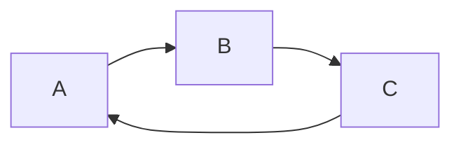

# Personal Knowledge Base

## Setup
Link file locations to the files in this repo:
```bash
ln -s ~/[path-to-rkb]/configs/.bashrc ~
ln -s ~/[path-to-rkb]/configs/.tmux.conf ~
```

## Content
### configs
Contains config files to make working on different machines bearable.

### dockerfiles
Contains dockerfiles which can be used as is, but their main purpose is to build containers for the container registry (see later section).


### knowledge
Contains the knowledge I've gathered over the years. Often contains snippets.

### notes
Notes related to this knowledge base in general.

### scripts
Contains (generalised) scripts (and other files) which I use often.

### shortcuts
Files with shortcuts because I can't remember them all.

## Container Registry
This Gitlab Project also acts as Docker Container Registry.
Dockerfiles are stored in `dockerfiles` and images are stored in Gitlab's Container Registry linked to this project.
General workflow looks like this:
```bash
# Update changed dockerfile
docker build -f [NAME].Dockerfile -t registry.gitlab.com/r.stegeman/rkb/[NAME] .
# Push changes to Gitlab
docker push registry.gitlab.com/r.stegeman/rkb/[NAME]
# Pull image and run container from anywhere.
docker run -it --rm --name [NAME]-container registry.gitlab.com/r.stegeman/rkb/[NAME]
```
To update and push all dockerfiles in `/dockerfiles/` simply run `/dockerfiles/update.py`.


