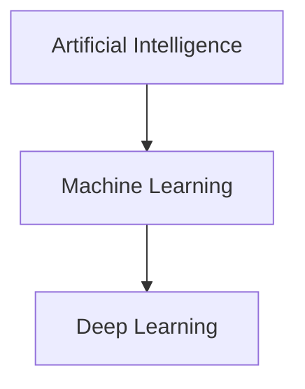
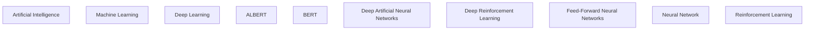

# AI
When dealing with Artificial Intelligence, Machine Learning, Deep Leaning, Neural this, Regression that, and the whole shebang, I often get lost mentally. Take a look at the glossary and the scope defined by the two letters 'AI' becomes clear. In this document will be describing Artificial Intelligence as I perceive it. This means it might not be 100% accurate (corrections welcome!).

## Contents
[Introduction](#introduction)
[Architectures](#architectures)
[Appendix](#appendix)
[Glossary](#glossary)
[References](#references)

## Introduction
Let's get right into clarifying by ordering some top-level terminilogy:

Artificial Intelligence (AI) is a very broad term which can be used whenever we want to simulate any level of intelligence in machines. This could range from a pile of if-statements to perfectly copying human behaviour.
Machine Learning (ML) is a subset of AI which is able to adapt or change, without human interference, when fed data. When all goes according to plan we can call this change *learning*.
When we talk about Deep Learning (DL) we usually refer to Deep Artificial Neural Networks (Deep NN). This is basically a way to differentiate simple Neural Networks (NN) from complex ones. Usually we call NN's with more than one hidden layer Deep NN's. Deep NN's use more layers and/or computations which gives them the potential to learn more (complex) features at the expense of a higher computational intensity.

## Architectures
In this section we will explore many different architectures. I will try to follow a logical order but keep your mouse on the scrollwheel. An AI Family Tree Graph (W.I.P.) can be found in the Appendix.

## Appendix
### AI Family Tree

## Glossary
**ALBERT** A Light BERT
**AI** Artificial Intelligence
**BERT** Bidirectional Encoder Representations from Transformers
**DANN** Deep Artificial Neural Networks
**DL** Deep Learning
**DRL** Deep Reinforcement Learning
**FFNN** Feed-Forward Neural Networks
**ML** Machine Learning
**NN** Neural Network
**RL** Reinforcement Learning

## References
[OCDevel - Podcast - Machine Learning Guide](http://ocdevel.com/mlg)
[Pathmind - Article - Artificial Intelligence (AI) vs. Machine Learning vs. Deep Learning](https://pathmind.com/wiki/ai-vs-machine-learning-vs-deep-learning)

## TODO
Notes for myself of what to add.
* Transformers
* Bayes
