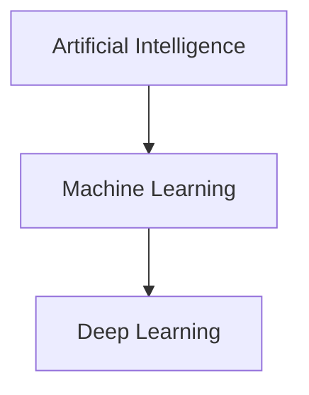
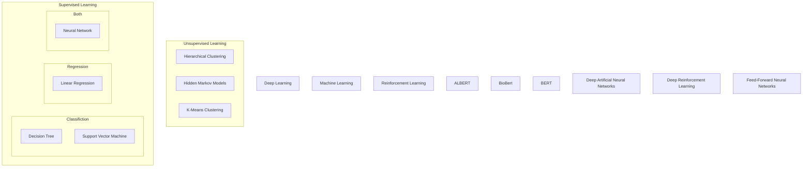

<!-- 
https://sites.psu.edu/symbolcodes/codehtml
https://mermaid-js.github.io/mermaid/#/
 -->
# AI
When dealing with Artificial Intelligence, Machine Learning, Deep Leaning, Neural this, Regression that, and the whole shebang, I often get lost mentally. Take a look at the glossary and the scope defined by the two letters 'AI' becomes clear. In this document will be describing Artificial Intelligence as I perceive it. This means it might not be 100% accurate (corrections welcome!).

## Contents
[Introduction](#introduction)
[Concepts](#concepts)
[Architectures](#architectures)
[Appendix](#appendix)
[Glossary](#glossary)
[References](#references)

## Notice
RIP Mermaid diagrams after moving to Github.

## Introduction

Artificial Intelligence (AI) is a very broad term which can be used whenever we want to simulate any level of intelligence in machines. This could range from a pile of if-statements to perfectly copying human behaviour.
Machine Learning (ML) is a subset of AI which is able to adapt or change, without human interference, when fed data. When all goes according to plan we can call this change *learning*.

<!-- generated by mermaid compile action - START -->

  
Mermaid markup

<!-- generated by mermaid compile action - END -->

When we talk about Deep Learning (DL) we usually refer to Deep Artificial Neural Networks (Deep NN). This is basically a way to differentiate simple Neural Networks (NN) from complex ones. Usually we call NN's with more than one hidden layer Deep NN's. Deep NN's use more layers and/or computations which gives them the potential to learn more (complex) features at the expense of a higher computational intensity.

ML can be further divided into supervised learning, unsupervised learning and reinforcement learning. Supervised learning can be broken up into classification and regression. Classification is the assigning of classes (e.g. predicted lung disease) and regression will give a non-categorical number (e.g. predicted house price). Unsupervised learning is also known as clustering.

One of the most basic machine learning algorithms, which almost everyone starts with, is linear regression.

## Concepts
In this section some concepts will be explained in greater detail.

### Reinforcement Learning
%TODO

## Architectures
In this section many different ML architectures/algorithms/models will be explored. I will try to follow a logical order but can't guarantee full linear logic. An AI Family Tree Graph (W.I.P.) can be found in the Appendix.

### Linear regression
Hypothesis function: 
> h&theta;(x) = &theta;0 x0 + &theta;1x1 + &theta;2x2...  
> Where:
>
>> h = hypothesis 
>> x = feature 
>> &theta; = weight
> 
> Example:
>
>> predicted house price(house features) = weight_1 * nr of bedrooms + weight_2 * square feet + weight_3 * house age

## Appendix
### AI Family Tree

<!-- generated by mermaid compile action - START -->

  
Mermaid markup

<!-- generated by mermaid compile action - END -->

## Glossary
**ALBERT** A Light BERT
**AI** Artificial Intelligence
**BERT** Bidirectional Encoder Representations from Transformers
**DANN** Deep Artificial Neural Networks
**DL** Deep Learning
**DRL** Deep Reinforcement Learning
**FFNN** Feed-Forward Neural Networks
**ML** Machine Learning
**NN** Neural Network
**RL** Reinforcement Learning

## References
[OCDevel - Podcast - Machine Learning Guide](http://ocdevel.com/mlg)
[Pathmind - Article - Artificial Intelligence (AI) vs. Machine Learning vs. Deep Learning](https://pathmind.com/wiki/ai-vs-machine-learning-vs-deep-learning)

## TODO
Notes for myself of what to add.
* Transformers
* Bayes
